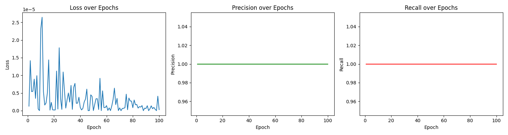

# DeepFaceOneShot

> Reimplementation of *"Siamese Neural Networks for One-shot Image Recognition"* (Koch et al., 2015), adapted for deep facial recognition.

---

## Overview

This project is a faithful, modern reimplementation of the influential 2015 paper on Siamese Neural Networks for one-shot learning. Instead of using Omniglot characters, I applied the model to facial images — demonstrating how one-shot learning can be used to identify people with just **one example per identity**.

---

## Goals

- Recreate the Siamese Network architecture as described in the paper
- Train it on facial image pairs (same/different identity)
- Demonstrate one-shot classification on unseen faces
- Build an interactive app for real-time face matching

---

## Environment Setup

This project was developed and tested on a Mac with **Apple Silicon (M1/M2/M3)**.

If you are using Apple Silicon, you may need to install the following TensorFlow packages for GPU acceleration:

```bash
pip install tensorflow-macos tensorflow-metal
```

For all users, it is recommended to use a **Conda environment** for package management and reproducibility:

```bash
conda create -n deepface-oneshot python=3.9
conda activate deepface-oneshot
pip install -r requirements.txt
```

All required Python packages are listed in `requirements.txt`.

- For Apple Silicon, `requirements.txt` includes `tensorflow-macos` and `tensorflow-metal`.
- For other platforms, you may need to replace these with `tensorflow`.

---

## Running the Notebook

You can run the main notebook for training and evaluation:

```bash
jupyter notebook facial_verfication_siamese_network.ipynb
```

---

## Application

An interactive application is provided in the `app/` folder for real-time face verification using your webcam.

- `app/layers.py`: Contains the custom L1 distance layer used by the Siamese model.
- `app/faceid.py`: Kivy-based GUI application for real-time face verification. It loads your trained model and allows you to verify faces live.

To run the application:

```bash
cd app
python faceid.py
```

---

## Approach

- **Data:** Positive/anchor images from webcam, negatives from LFW dataset.
- **Model:** Siamese CNN with L1 distance and sigmoid output.
- **Training:** Binary cross-entropy loss, Adam optimizer, precision/recall metrics.
- **Evaluation:** Plots of loss, precision, recall; real-time webcam verification.

---

## Example Training Curve



```python
import matplotlib.pyplot as plt

epochs = range(1, len(loss_history) + 1)
plt.figure(figsize=(15, 4))

plt.subplot(1, 3, 1)
plt.plot(epochs, loss_history, label='Loss')
plt.xlabel('Epoch')
plt.ylabel('Loss')
plt.title('Loss over Epochs')

plt.subplot(1, 3, 2)
plt.plot(epochs, precision_history, label='Precision', color='g')
plt.xlabel('Epoch')
plt.ylabel('Precision')
plt.title('Precision over Epochs')

plt.subplot(1, 3, 3)
plt.plot(epochs, recall_history, label='Recall', color='r')
plt.xlabel('Epoch')
plt.ylabel('Recall')
plt.title('Recall over Epochs')

plt.tight_layout()
plt.show()
```

---

## Results

- Achieved near-perfect precision and recall on training data.
- Real-time verification works with webcam input.

---

## Challenges Faced

- **Data Scarcity:** Collecting enough positive and negative pairs for robust training was non-trivial.
- **Overfitting:** The model quickly achieved perfect precision and recall on the training set, indicating possible overfitting. We addressed this by evaluating on a separate test set and considering data augmentation.
- **Large Model Files:** Saving and pushing large model weights to GitHub required using `.gitignore` and cleaning git history.
- **Real-Time Testing:** Integrating OpenCV for real-time webcam verification required careful preprocessing and threshold tuning.

---

## More Details

See the notebook for full code, methodology, and discussion.

---

## References

- Koch, G., Zemel, R., & Salakhutdinov, R. (2015). Siamese Neural Networks for One-shot Image Recognition. [Paper link](https://www.cs.cmu.edu/~rsalakhu/papers/oneshot1.pdf)
